This is a [Next.js](https://nextjs.org/) project bootstrapped with [`create-next-app`](https://github.com/vercel/next.js/tree/canary/packages/create-next-app).

## Getting Started

First, run the development server:

```bash
npm run dev
# or
yarn dev
# or
pnpm dev
# or
bun dev
```

Open [http://localhost:3000](http://localhost:3000) with your browser to see the result.

You can start editing the page by modifying `app/page.tsx`. The page auto-updates as you edit the file.

This project uses [`next/font`](https://nextjs.org/docs/basic-features/font-optimization) to automatically optimize and load Inter, a custom Google Font.

## Practicum Report

|  | Framework Based Programming 2024 |
|--|--|
| NIM |  2141720067|
| Nama |  Saefulloh Fatah Putra Kyranna |
| Kelas | TI - 3I |

## Practicum 1

In this practicum, we have learnt about how to make event handler from components. This is done to respond to whatever input the user made on the website. To do this, we will make a component first before adding an event to the component. 

``````
export default function Button_01(){
    //function for clicking the button
    function handleClick(){
        alert("The button is pressed!!");
    }

    function handleMouseOver(){
        alert("Please press the button");
    }

    return (
        <button className="bg-blue-500 hover:bg-blue-700 text-white p-2 rounded"
            onClick={handleClick}
            // onMouseOver={handleMouseOver}
            onMouseLeave={() => {
                    alert("Leaving so soon?")
                }
            }
        >
            This is a button
        </button>
    );
}
``````

After creating the component, we will import and call it from the ``page.tsx`` file. 

Output: 

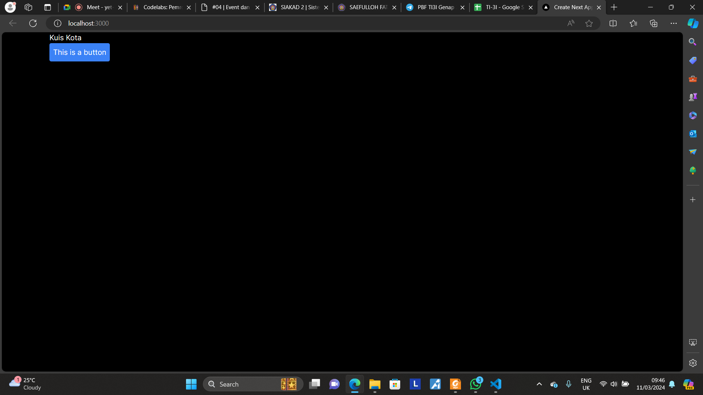

As we can see with the output, there is a button which will return an alert if clicked. 

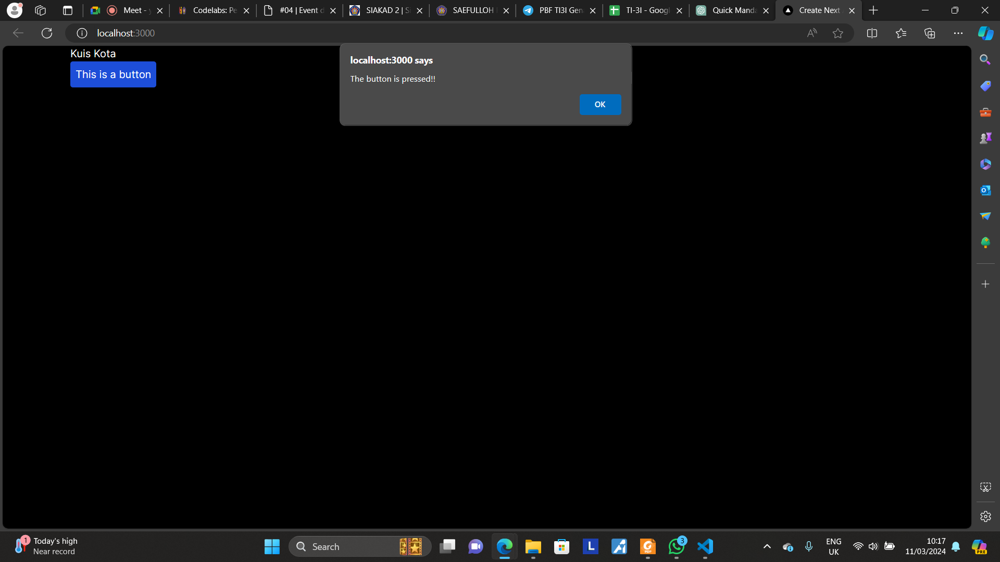

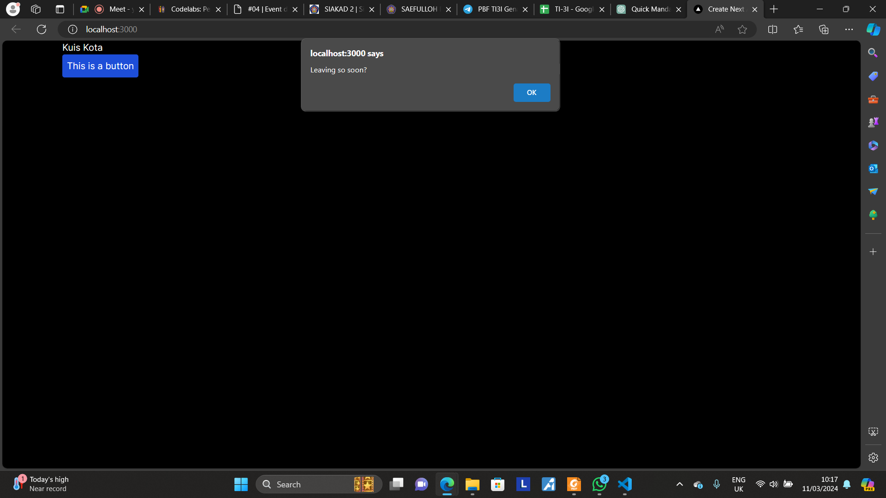

## Practicum 2

In this practicum, we have learnt about how to make a dynamic event handler. This is done to make the website more adaptable to various requirement. However, during the course of this practicum, we encountered some errors in the code. 

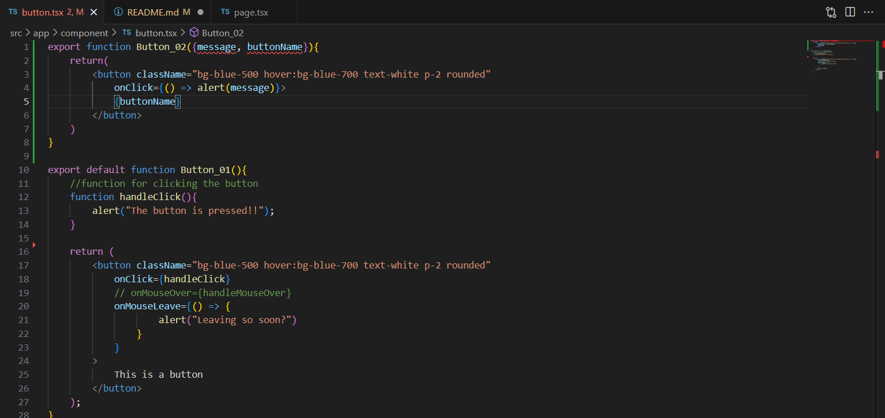

This error happens because we have not defined the message and button name yet, therefore the ``button.tsx`` file returns an error. However, after we define the name of the button and the message, the website works as intended. 

Output: 

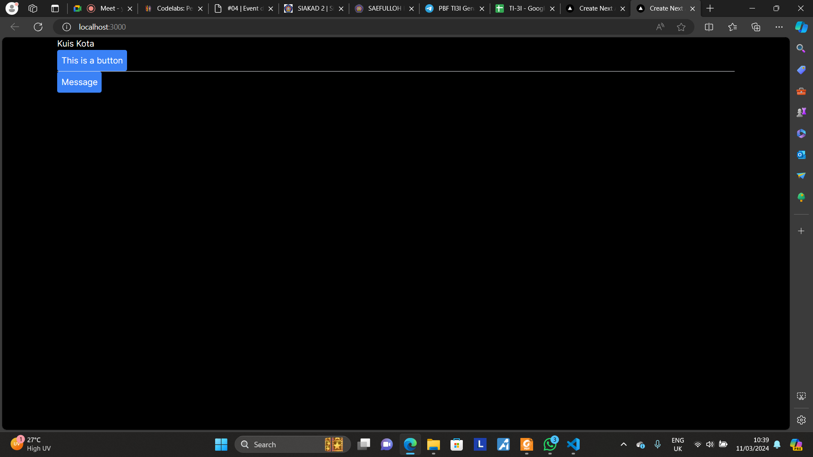

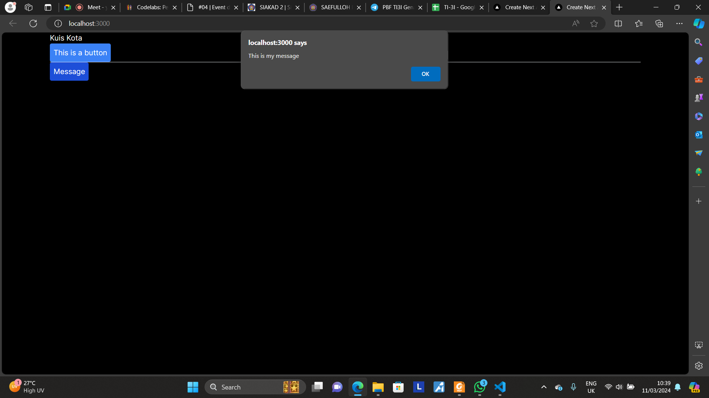

## Practicum 3

In this practicum, we have learnt about event propagation. This event happens because event handler will catch any event from any child that are owned by parent component. The demonstration of this event propagation is displayed on the output. 

Output: 

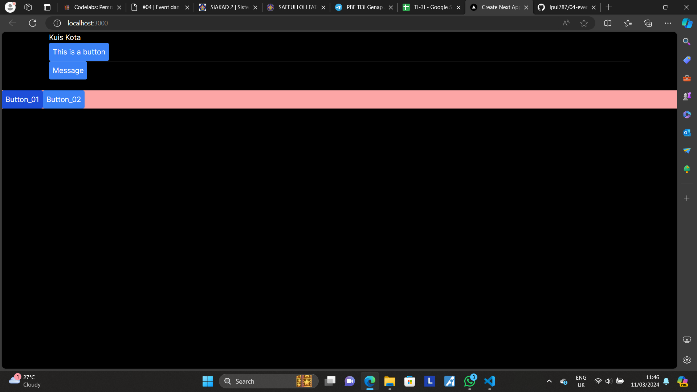

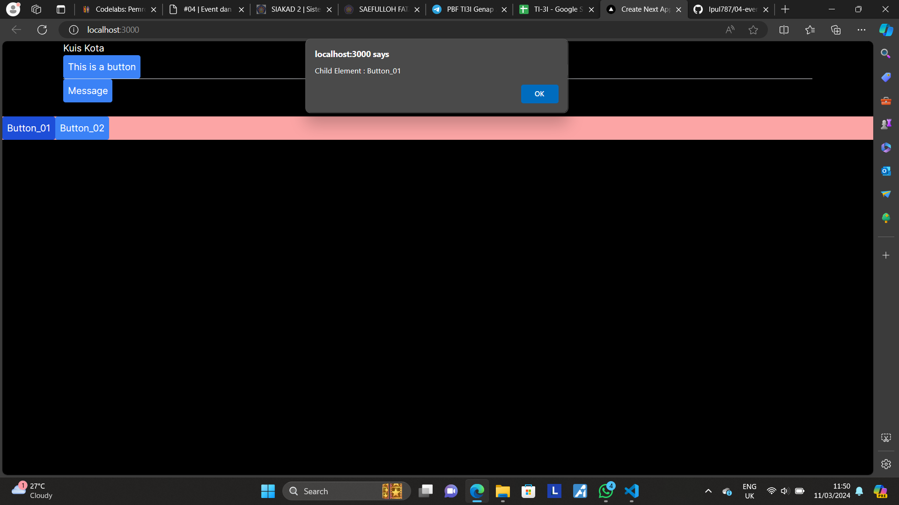


As we can see, the button returns the alert of parent element when pressed. This is because event handler also catches the parent component and display it along with the child component. To stop this, we can stop event propagation by inserting the code into the component. 

``````
 onClick={(e) => {
                e.stopPropagation();
                alert(message)
                }
            }>
``````

By entering this code, the event handler will not call the parent component once the event was executed. 

## Practicum 4

In this practicum, we have learnt about the use of state to change the website display based on user input. This method is useful to display various items from a list. 

Output: 

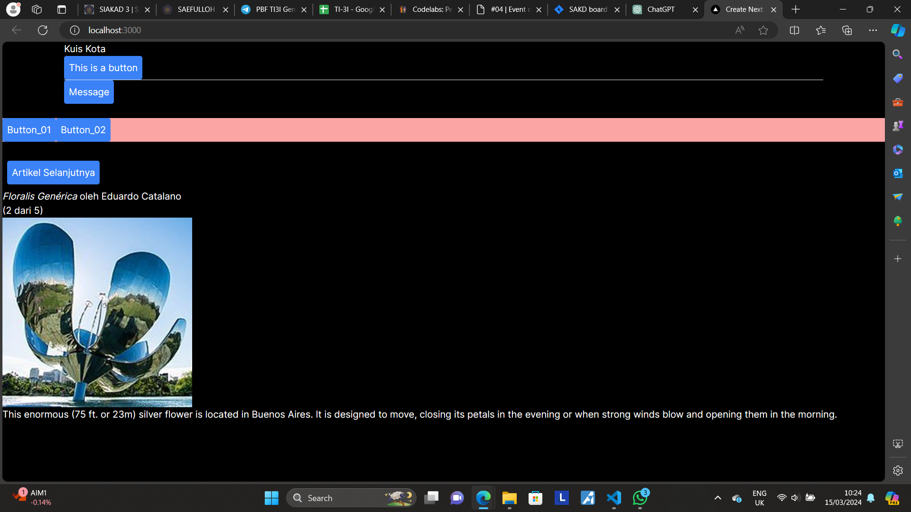

When we run the code, it worked smoothly until we run out articles. In that case, the system returns a runtime error. We could fix this by adding a conditional statement on handleClick function that will set the index to 0 if the pointer reaches the end of the list. 

``````
function handleClick() {
    if (index < sculptureList.length - 1) {
        setIndex(index + 1);  // counter index + 1, utk melihat data selanjutnya
    } else {
        // Reset index ke 0 untuk kembali ke awal
        setIndex(0);
    }
}
``````

With previous article button: 

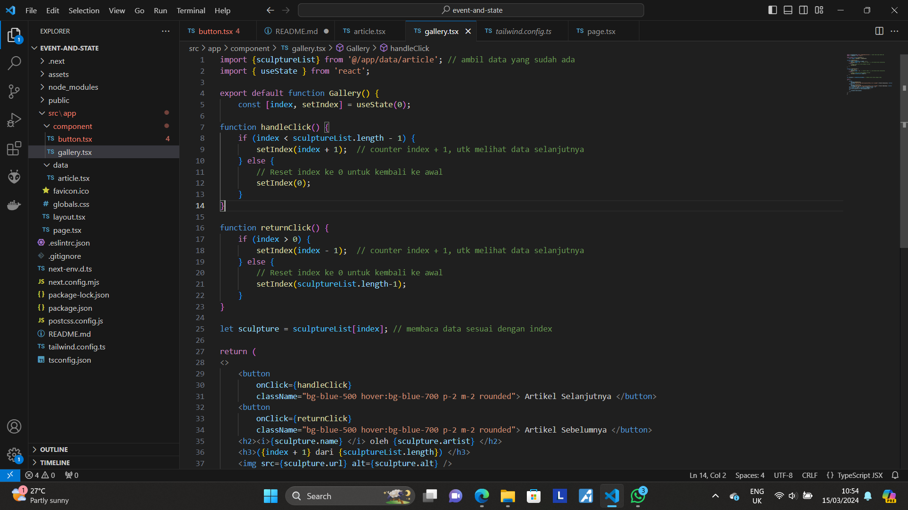

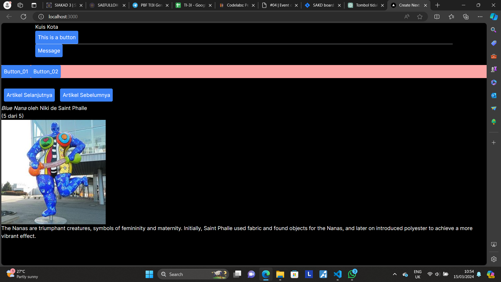

## Practicum 5

In this practicum, we have learnt about state structure to differentiate component and make error tracking easier. This practicum also discusses about state sharing with other components to understand the flow of the state. 

Source code: 

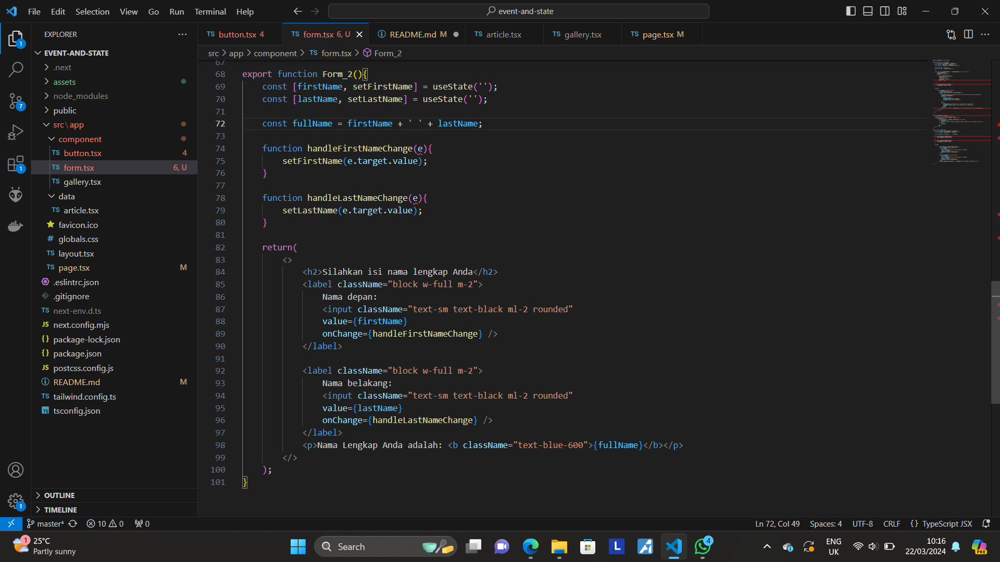

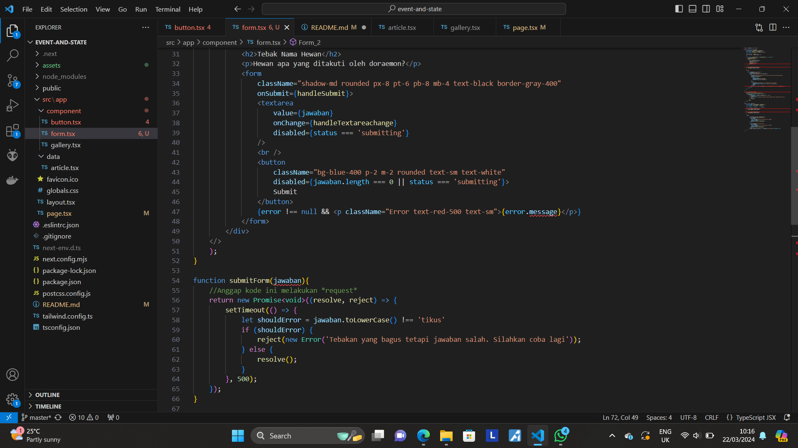

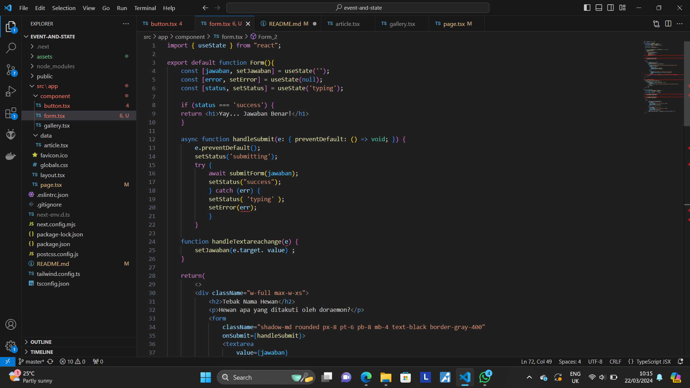

Output: 

Correct answer: 

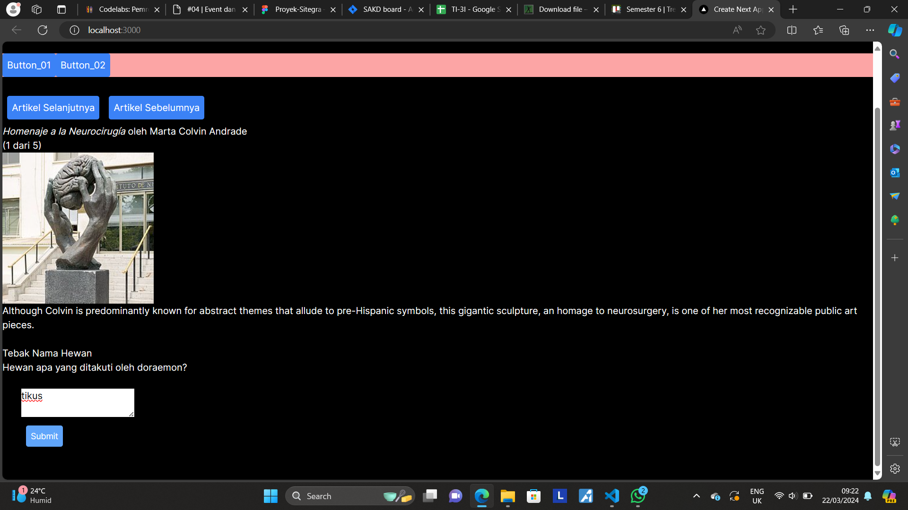

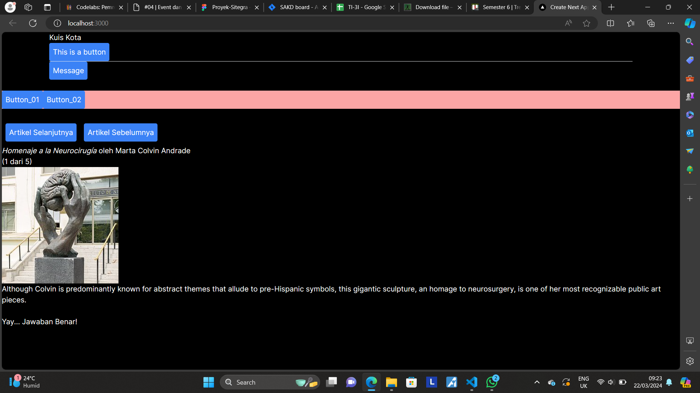

Wrong answer: 

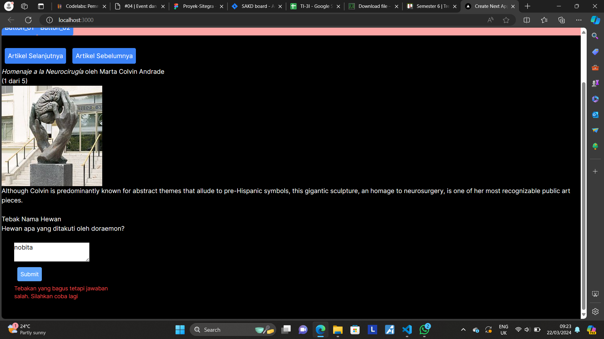

Now let's dive into the output of form.tsx when we add Form_2

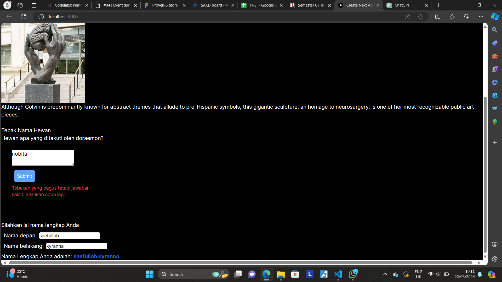

In this class, we will add first name and full name of a person into the form. The difference lays in the source code. In the first version, there is a state called fullName in both setFirstName and setLastName function. This makes it redundant and prone to bugs. We will change the code that doesn't include the redundancy. 

If we delete the fullName state, the code will be simpler and easier to understand. Furthermore, error tracking is easier in a much simpler code. The output of the code is similar to the previous code. 

## Practicum 6

In this practicum, we have learnt about the state sharing, meaning two components that shares the same state.